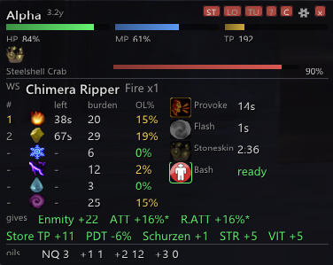
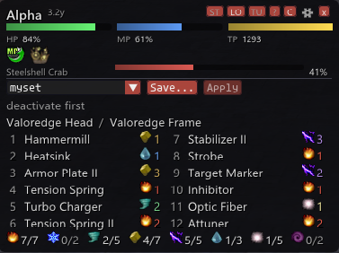
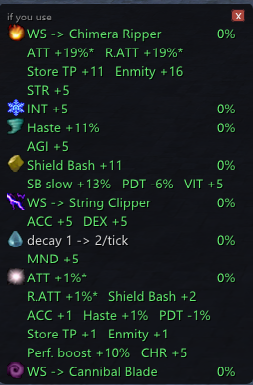
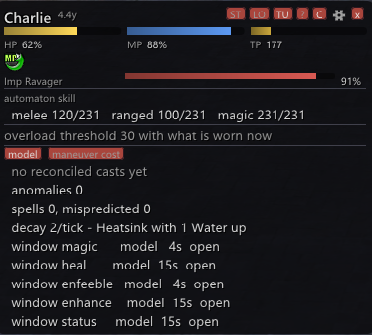
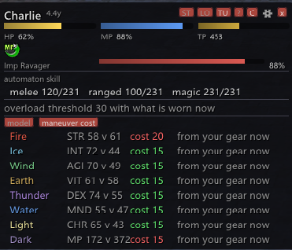
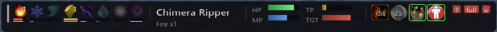

# clockwork

> **Not approved for use on HorizonXI.** clockwork is pending approval and is not
> currently approved for use on HorizonXI

An [Ashita](https://www.ashitaxi.com/) 4.3 addon for [HorizonXI](https://horizonxi.com/):
a HUD for **Puppetmaster**. It shows you what your automaton is actually doing —
burden and overload risk per element, which maneuvers are up, what weaponskill is coming
next, what your attachments are worth right now — and it can log every case where its own
prediction did *not* match the server, so the model can be corrected from real play.

## Features

- **Burden and overload per element.** Burden is tracked for all eight elements
  separately, with the current overload chance, the chance your *next* maneuver would
  create, and how long an overload would last. The threshold is read off the gear you are
  actually wearing, so a Fire maneuver in Puppetry Dastanas resolves at a different number
  than a Water maneuver in Devotee's Mitts. An element with nothing up that cannot
  overload anything yet can be hidden from the table (**hide burden at 0% OL**, Settings
  tab).
- **Maneuver slots and decay.** What is up, how long each has left, and the real decay
  rate — the Heatsink behaviour this model assumes for Horizon, not upstream's.
- **Weaponskill prediction.** What the automaton will use next, and why, with skillchain
  properties for automaton skills, player weaponskills and avatar skills.
- **Recast clocks.** Live timers for the automaton's abilities and its ranged shot.
- **Loadout tab.** Head, frame and every attachment with its live modifier values, plus
  capacity per element. Saved attachment sets with a preview and a confirmed apply,
  paced a second a step as pupsets is.
- **What-if sidebar.** For each of the eight elements, what using that maneuver *right
  now* would change and what it would cost.
- **Anomaly log.** A JSONL record of every maneuver and automaton weaponskill, with
  mismatches between prediction and reality flagged. Off by default; turn it on from
  the Settings tab.
- **Demo mode.** `/cw demo` walks four made-up automatons so you can see and size the HUD
  without being on PUP.

## Screenshots

| | |
|---|---|
| **Loadout** — head, frame and attachments, capacity per element, and the saved-set picker | **What-if sidebar** — what each maneuver would change if you used it now |
|  |  |
| **Tuning → model** — automaton skill, the overload threshold, anomalies and spell windows | **Tuning → maneuver cost** — each element's stat check and what its 1st, 2nd and 3rd maneuver costs |
|  |  |

**Compact** (`/cw compact`) — the whole HUD on one line:

## Install

1. Download the latest `clockwork.zip` from
   [Releases](https://github.com/patheed-ffxi/clockwork/releases), or clone this repo.
2. Put the `clockwork` folder into your Ashita `addons` directory, so that you have
   `addons/clockwork/clockwork.lua` with `cw/` and `assets/` beside it.
3. In game: `/addon load clockwork`

To load it every time, add `/addon load clockwork` to your Ashita script.

## Commands

`/clockwork` and `/cw` are the same command. Bare `/cw` prints this list.

| Command | Does |
|---|---|
| `/cw show` | the panel on or off (the model and the log run either way) |
| `/cw compact` | the one-line strip instead of the full panel |
| `/cw demo` | made-up automatons, for looking at the HUD off PUP; each `/cw demo` is the next one, then off again |
| `/cw attachments` | the attachments you own |
| `/cw equipped` | head, frame and attachments |
| `/cw stat` | the stat you wear when each maneuver goes off — `/cw stat wind 83`, `now` to take what you are wearing, `off` to go back to reading it. See *Gear swaps* below |
| `/cw reset` | clear burden, learned costs and counters |
| `/cw sync` | burden to zero — manual resync only |

## Settings and files

clockwork writes these under your Ashita config directory:

- `config/addons/clockwork/settings.txt` — plain `key = value`, one per line, saved
  whenever you change a setting in game. A whitelist of display and reporting keys only;
  the model constants are deliberately *not* reachable from the UI, so an old settings
  file can never resurrect a value that has since been corrected.
  Unknown keys and wrong types are ignored. The one thing saved here that is not a
  display key is `stat_<Element>` — your own stat for that maneuver, from `/cw stat`.
- `config/addons/clockwork/<Character>_YYYY.MM.DD.jsonl` — the log, one JSON object per
  line. Off by default: turn it on from the Settings tab.
- `config/addons/clockwork/sets/<name>.txt` — saved attachment sets, one item name per
  line: the same format the `pupsets` addon uses, so a file copied either way just works.

## Accuracy — please read

clockwork re-implements a slice of the server's Puppetmaster logic on the client. It does
not read the server's mind.

Where this model departs from upstream LandSandBoat for HorizonXI — the Heatsink decay,
the burden an automaton arrives with, the weaponskill tie-break — the departure is a model
assumption, not a verified server rule. **Many of the other values were transcribed from
LandSandBoat and are unverified on HorizonXI**, including most attachment effects and several
ability recasts. Treat a number on the HUD as the model's answer rather than the
server's, and please report the ones that turn out wrong.

### Gear swaps

A maneuver costs 15 burden when your stat meets or beats the automaton's and 20 when it
does not, compared as the maneuver goes off — so a gear-swap addon that puts a stat set on
for the maneuver changes the answer. **clockwork cannot see that set.** The client is only
told your stats when it asks (opening the status or equipment menu) or when something like
a level or a kill makes the server send them, and *never* because you swapped gear, so the
stats it reads are whatever you were wearing at the last such moment.

If you swap for maneuvers, tell it what you wear: `/cw stat wind 83`. That number is
compared against the automaton's live stat, so the check is still lost once that element is
stacked and its stat climbs past yours. `/cw stat wind now` takes the value from memory —
open the equipment menu while wearing the set first, or it will take the stale one — and
`/cw stat wind off` goes back to reading it. The values are saved, and the Tuning tab's
cost view says `your setting` for an element using one. Change food, sub job or gear and
the number is stale: a stat check that contradicts it is logged, and says so.

## Reporting a wrong prediction

Open an issue at [github.com/patheed-ffxi/clockwork/issues](https://github.com/patheed-ffxi/clockwork/issues)
with:

- the clockwork version (`addon.version` at the top of `clockwork.lua`);
- your automaton's head, frame and attachments (`/cw equipped`), and which maneuvers were up;
- what clockwork predicted, and what the automaton or the server actually did;
- a short excerpt of the log around it. Turn on **write a log file** (or **anomalies to
  the file**) on the Settings tab first; the records where the prediction missed are
  tagged `burden_mismatch`, `ws_mispredicted`, `spell_mispredicted` or `recast_early`.

The log's filename carries your character's name, and its records name the mobs and the
abilities involved — check an excerpt before you post it.

## Requirements

- Ashita 4.3 or later — the HUD uses the ImGui font API that version brings
- Built for HorizonXI (era-locked, level cap 75). It will load anywhere Ashita
  runs, but the burden and overload constants are the model's Horizon assumptions.

## Future improvements

- Configure attachment sets directly from the Loadout tab.
- A more customizable Status tab.
- Master ability cooldowns in the Status tab.

## Credits

clockwork stands on other people's work:

- **[LandSandBoat](https://github.com/LandSandBoat/server)** — the burden, overload,
  weaponskill, spell and attachment logic is re-implemented from its
  `automatonentity.cpp`, `automaton_controller.cpp`, `automaton.lua` and SQL tables.
  Where this model departs from it for Horizon, the departure is a model assumption.
- **chains** (Ivaar) — the skillchain properties of player weaponskills, automaton skills
  and avatar skills, which are era-tuned and differ from upstream on several skills.
- **fancychat** (Arielfy) — the action packet `0x028` bit layout is adapted from its
  `lib/combat_packets.lua`, itself adapted from the Azu-XI fork of atom0s' simplelog.
- **pupsets** (built on atom0s' Ashita v4 blusets) — the automaton attachment memory
  layout and the equip call are adapted from it, and the saved set file format is
  deliberately compatible.
- **mobdb** (ThornyFFXI) — the eight element gems in `assets/elements/` are its icon files,
  which are the game's own element art. See the README there.

## License

clockwork's code is released under the [MIT License](LICENSE). That license covers the
code in this repository, not Square Enix's artwork: the element gems in
`assets/elements/` are Final Fantasy XI's own art, redistributed as other Ashita addons
do, and remain Square Enix's property.

This is a fan-made tool for a fan-run server. Final Fantasy XI is the property of Square
Enix; no affiliation or endorsement is claimed.
